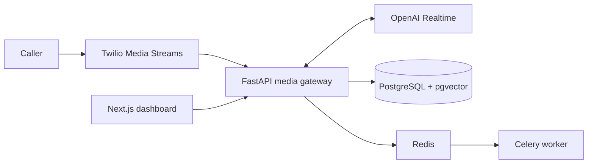

# Revenue Recovery Voice Agent

Telephony-native AI receptionist for inbound home-service calls. Twilio Media Streams carries native 8 kHz PCMU audio to the OpenAI Realtime bridge while calls, turns, tool outcomes, interruptions, and post-call analysis become replayable dashboard records.

## Project status

This is a demo-oriented deployment, not a production template. Offline evaluation and the deterministic fixture replay run locally. Real provider calls, clean database migrations, deployment health checks, and the live call beats in [`docs/DEMO_SCRIPT.md`](docs/DEMO_SCRIPT.md) remain required for sign-off.

## Architecture



## Included capabilities

- Twilio webhook and media-stream boundary.
- OpenAI Realtime relay and deterministic provider-free fixture replay.
- Call, transcript, tool, interruption, latency, cost, and escalation views.
- Post-call recording, analysis, and CRM synchronization worker contracts.
- Safety paths for consent, opt-out, provider degradation, and human transfer.

## Quick start

Prerequisites: Python 3.12+, [`uv`](https://docs.astral.sh/uv/), Node.js 20+, npm, and Docker Desktop.

For the provider-free fixture showcase:

```powershell
.\start-dev.ps1
```

The launcher starts the fixture Compose profile. Open `http://127.0.0.1:3101/calls`.

For the full local stack:

```powershell
Copy-Item .env.example .env
uv sync
uv run alembic upgrade head
docker compose up --build
```

The API is available at `http://localhost:8000`; the dashboard is at `http://localhost:3000`.

## Verification

```powershell
uv run ruff check .
uv run mypy apps
uv run pytest
uv run eval-run --json
uv lock --check
npm --prefix apps/web run build
uv run alembic heads
```

## Project structure

```text
apps/api/       FastAPI control plane, media gateway, tools, and health checks
apps/web/       Next.js call replay dashboard
apps/eval/      Provider-free scenario evaluation
config/         Client configuration and safety policy
alembic/        Database migrations
tests/          Unit, integration, and evaluation tests
```

## Provider setup

Live calls require a public HTTPS `PUBLIC_BASE_URL`, Twilio configuration, OpenAI Realtime access, and optional Cal.com, HubSpot, Anthropic, and Stripe credentials. Keep provider keys server-side. Signature validation must remain enabled outside isolated local troubleshooting. Follow [`docs/deployment.md`](docs/deployment.md) for deployment and go-live checks.

## Documentation

- [`docs/DEMO_SCRIPT.md`](docs/DEMO_SCRIPT.md) - live and fixture walkthrough.
- [`docs/deployment.md`](docs/deployment.md) - infrastructure, secrets, and handoff.
- [`docs/tasks.md`](docs/tasks.md) - remaining verification work.
- [`task.md`](task.md) - implementation plan and evidence history.

## Production boundary

Production requires independently observable API, worker, dashboard, database, Redis, provider callbacks, recording retention/deletion, reconnect handling, alerting, trace correlation, backups, restore tests, and real-call verification. Fixture replay does not prove provider reachability or call quality.
