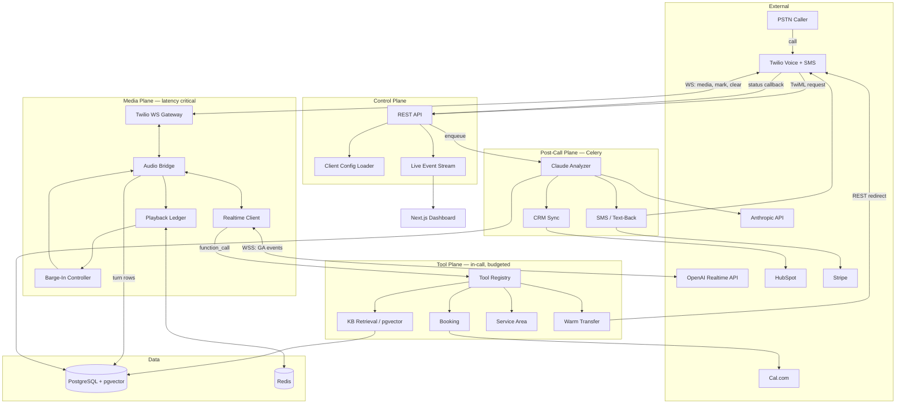
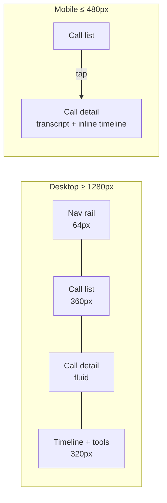

Prd · MD
# Revenue Recovery Voice Agent
 
**A telephony-native AI receptionist that answers, qualifies, and books inbound calls a business would otherwise lose — built directly on Twilio Media Streams and the OpenAI Realtime GA API, with no managed voice-agent vendor in the path.**
 
| Field | Value |
|---|---|
| Version | 1.0 |
| Status | Approved for build |
| Date | 2026-07-23 |
| Author | Manav |
| Reference client | Northside HVAC (fictional, demo vertical) |
| Timeline | 5 weeks |
 
---
 
## Project Summary
 
We are building a single-tenant, config-driven voice agent that answers a business's phone line, holds a real-time spoken conversation, calls tools mid-conversation (calendar, service-area lookup, knowledge base, CRM, payment link), and hands off to a human when it should. The media plane is a FastAPI WebSocket process that bridges Twilio Media Streams to the OpenAI Realtime API in raw G.711 μ-law, with no transcoding on the hot path. Post-call, a Celery pipeline runs Claude over the transcript to produce a structured summary, intent and sentiment labels, a QA score, and CRM writes. The dashboard is Next.js.
 
The obvious version of this wraps Retell or Vapi and ships in four days. This one owns the media plane, which means it owns the three things that decide whether a voice agent sounds human or sounds broken: **barge-in truncation accounting** (the caller interrupts at 1.4s; the model believes it said all 6s; without reconciliation the conversation permanently desyncs), **latency masking during tool calls** (a 900ms calendar lookup is dead air unless something speaks over it), and **failure recovery** (the booking API times out and the agent must degrade to a callback promise, not silence). Owning the socket is also what makes per-client tuning a config file instead of a vendor dashboard.
 
---
 
## Table of Contents
 
1. [Product Overview](#product-overview)
2. [Technology Stack](#technology-stack)
3. [System Architecture](#system-architecture)
4. [Core Design: Real-Time Conversation Control](#core-design-real-time-conversation-control)
5. [Design System](#design-system)
6. [Build Plan](#build-plan)
7. [Open Decisions & Future Scope](#open-decisions--future-scope)
8. [Appendix: References](#appendix-references)
---
 
## Product Overview
 
### Problem Statement
 
- A missed after-hours call at an HVAC company is not a missed call, it is a competitor's booked job. The business is closed from 6 PM to 8 AM and unstaffed on Sundays — roughly **60% of the week's clock is unanswered**, and emergency HVAC calls skew heavily into exactly those hours. `[uncertain — the 60% is arithmetic on stated hours, not measured call volume]`
- Voicemail is a dead end. The caller who reaches voicemail at 11:40 PM has already dialed the next result before the beep finishes. No callback list is generated, so the lead is not merely delayed, it is unrecorded.
- Existing IVR trees answer, then fail. "Press 1 for service" cannot determine whether a caller is inside the service area, whether the unit is under warranty, or whether this is an emergency worth dispatching at midnight.
- Off-the-shelf voice agents break on interruption. When a caller cuts in at 1.4 seconds into a 6-second reply, a naive bridge keeps the full 6 seconds in the model's conversation state. The model then answers a question the caller never finished hearing, and every subsequent turn is misaligned.
- Tool latency becomes dead air. A calendar availability lookup takes 400–900ms. During that window a naive agent is silent, and callers interpret silence on a phone line as a dropped call and hang up.
### Vision
 
> The phone line stops being a cost center that leaks revenue between 6 PM and 8 AM, and becomes the highest-converting intake channel the business owns — because it answers on the second ring, every time, and finishes the booking instead of taking a message.
 
> Own the media plane. Every quality problem worth solving in voice AI — interruption, latency, recovery, cost control — lives in the bytes between the carrier and the model. A vendor abstraction over that layer is a ceiling on how good this can get.
 
### Success Metrics
 
| Metric | Target |
|---|---|
| Voice-to-voice latency, caller stops speaking → first audio byte to Twilio | p50 ≤ 800 ms, p95 ≤ 1,400 ms |
| Barge-in cut-off: caller speech onset → last model audio byte queued to Twilio | ≤ 200 ms |
| Truncation accuracy: `audio_end_ms` sent vs. audio actually played | within ±100 ms |
| Answer latency: inbound ring → agent's first word | ≤ 6 s (2 rings) |
| Booking task success on the 40-scenario eval set | ≥ 85% |
| Tool call success rate, inclusive of retries | ≥ 99% |
| Tool-call dead air (window with no audio flowing to caller) | ≤ 400 ms |
| Cost per 4-minute call, all APIs inclusive | ≤ $0.45 `[uncertain — needs measurement in Week 1; hard budget ceiling enforced regardless]` |
| Missed-call text-back: Twilio status callback → SMS queued | ≤ 30 s |
| Post-call artifacts (transcript, summary, CRM write) available in dashboard | ≤ 90 s after hangup |
| Escalation precision: transfers that a human reviewer agrees needed a human | ≥ 90% on 20 labeled calls |
| **Qualitative** | In eval playback, the caller completes the booking without ever asking to speak to a person |
 
---
 
## Technology Stack
 
| Layer | Technology | Justification |
|---|---|---|
| Telephony | Twilio Programmable Voice + Media Streams | Bidirectional WebSocket audio is a hard requirement for barge-in control; Twilio's `mark`/`clear` protocol is the mechanism we use to measure played audio and flush the outbound buffer. |
| Speech-to-speech | OpenAI Realtime GA, `gpt-realtime-2.1` | Accepts and emits `audio/pcmu` natively, so 8 kHz μ-law passes end to end with zero resampling; a cascaded STT→LLM→TTS pipeline adds two serialization boundaries we cannot afford inside the 800 ms budget. |
| Media plane | Python 3.12 + FastAPI + `websockets` | One asyncio task pair per call is the natural shape for a two-socket relay; FastAPI is already the team's production stack, and the relay itself is I/O-bound so the GIL is not the constraint. |
| Post-call analysis | Claude (Anthropic API), Sonnet class | Post-call work is offline and quality-dominated, not latency-dominated; long-transcript reasoning and structured JSON extraction are the exact workload, and it is a different vendor from the realtime path so a single provider outage cannot take out both planes. |
| Primary datastore | PostgreSQL 16 + `pgvector` | Calls, transcripts, and the knowledge base are all queried together on the dashboard; a separate vector DB would add a service to operate for a corpus under 500 chunks per client. |
| Cache / ephemeral state | Redis 7 | Holds live call state (playback ledger, cost accumulator) that must survive a media-worker restart mid-call and be readable by the dashboard's live view without touching Postgres on every 20 ms frame. |
| Background jobs | Celery + Redis broker | The post-call pipeline is a five-step DAG measured in seconds with retries, not a durable multi-day workflow; see [Open Decisions](#decisions-to-make-before-building) for the Temporal trigger. |
| Frontend | Next.js 15 (App Router) + Tailwind + shadcn/ui | Server Components render the call list and analytics without a client-side data layer; the live transcript view is the only client-heavy surface and uses a single SSE stream. |
| Calendar | Cal.com API | Self-hostable and exposes explicit slot-hold semantics, so we can reserve a slot during the conversation and release it if the caller drops — Google Calendar has no hold primitive and would require us to write then delete events. `[uncertain — verify hold/reservation endpoint against current Cal.com API version in Week 2]` |
| CRM | HubSpot | Free tier is sufficient for the prototype and the contacts + deals object model maps cleanly to caller + job; GoHighLevel is the likelier real-client target and is isolated behind the `CRMPort` interface. |
| Payments | Stripe Payment Links, delivered by SMS | See [Payment Handling](#payment-handling). No card digits ever enter the audio path or the transcript. |
| LLM observability | Langfuse (self-hosted) | Traces both the realtime session and the Claude post-call chain under one trace ID; self-hosted because call transcripts are client PII. |
| Error tracking | Sentry | Media-plane exceptions are the ones that drop live calls; we need alerting inside a minute, not a log scrape. |
| Runtime | Docker Compose | Five services, one client, one VPS. Kubernetes here is cost without benefit. |
 
---
 
## System Architecture
 
### Bounded Contexts
 

 
### Communication Flow
 
1. Caller dials the Twilio number. Twilio POSTs to `/twiml/incoming` with `CallSid`, `From`, `To`.
2. The control plane resolves `To` → client config, checks the suppression list for `From`, and returns TwiML: a `<Say>` recording-consent preamble, then `<Connect><Stream url="wss://.../media/{call_id}">`.
3. Twilio opens the media WebSocket and sends `connected`, then `start` (carrying `streamSid` and custom parameters), then `media` frames — base64 G.711 μ-law, 8 kHz, 20 ms each.
4. On `start`, the gateway opens a WSS connection to OpenAI Realtime and sends `session.update` with `audio.input.format = {type: "audio/pcmu"}`, the same for output, `turn_detection.type = "semantic_vad"`, the client's stored prompt ID plus runtime variables, and the tool schemas enabled for this client.
5. Each Twilio `media` frame is forwarded as `input_audio_buffer.append`. **No transcoding.** The base64 payload is passed through unmodified.
6. Semantic VAD on OpenAI's side detects end of caller speech and emits `input_audio_buffer.speech_stopped`, then generates a response.
7. `response.output_audio.delta` events arrive. Each is written to Twilio as a `media` message, immediately followed by a `mark` message carrying a monotonic sequence number. The byte count is recorded in the playback ledger.
8. Twilio echoes each `mark` back once that audio has actually been played to the caller. The ledger converts acknowledged bytes to played milliseconds at 8,000 bytes/sec.
9. If the model instead emits a `function_call`, the tool plane dispatches it, and simultaneously an out-of-band filler response is created so the caller hears speech during the tool's latency window. See [Latency Masking](#latency-masking).
10. On caller interruption, OpenAI emits `input_audio_buffer.speech_started` and cancels the in-flight response. The barge-in controller sends Twilio a `clear` message and OpenAI a `conversation.item.truncate` carrying `audio_end_ms` read from the ledger. See [Barge-In](#barge-in-and-truncation-accounting).
11. On hangup, Twilio sends `stop` and fires a status callback. The gateway closes both sockets, flushes final turns to Postgres, and enqueues the post-call chain.
12. Celery runs: fetch recording → Claude analysis → persist structured result → CRM upsert → confirmation SMS. The dashboard receives updates over SSE.
### Directory Structure
 
```
revenue-recovery-agent/
├── apps/
│   ├── api/
│   │   ├── main.py                     # FastAPI app; mounts media WS + REST routers
│   │   ├── media/
│   │   │   ├── gateway.py              # WS endpoint Twilio dials; one instance == one call
│   │   │   ├── realtime_client.py      # OpenAI Realtime GA wrapper (GA event names only)
│   │   │   ├── bridge.py               # the relay; two asyncio tasks, no transcode
│   │   │   ├── playback_ledger.py      # mark acks -> played_ms; the truncation source of truth
│   │   │   ├── barge_in.py             # speech_started -> clear + truncate, ordered
│   │   │   └── budget_guard.py         # per-call cost + duration ceiling, kills runaway calls
│   │   ├── tools/
│   │   │   ├── registry.py             # name -> (schema, handler, timeout_ms, filler_phrase)
│   │   │   ├── service_area.py         # ZIP/postcode -> in-area bool; pure lookup, <5ms
│   │   │   ├── availability.py         # Cal.com slot search, timezone-resolved
│   │   │   ├── booking.py              # slot hold -> confirm; idempotent on (call_id, slot)
│   │   │   ├── knowledge.py            # pgvector top-k over the client KB
│   │   │   ├── crm.py                  # CRMPort impl; dedupes on E.164
│   │   │   ├── payment.py              # creates Stripe link, hands to SMS. Never reads digits
│   │   │   └── transfer.py             # warm transfer via Twilio REST call redirect
│   │   ├── telephony/
│   │   │   ├── twiml.py                # consent preamble + <Connect><Stream>
│   │   │   ├── status_webhook.py       # no-answer/busy/failed -> missed-call text-back
│   │   │   └── sms.py                  # outbound SMS + STOP/opt-out + suppression list
│   │   ├── domain/                     # pure functions, zero I/O, 100% unit-tested
│   │   │   ├── hours.py                # business hours, tz math, emergency-window rules
│   │   │   ├── qualification.py        # lead scoring; decides book vs. escalate vs. decline
│   │   │   └── escalation.py           # escalation trigger predicates
│   │   ├── workers/
│   │   │   ├── analyze.py              # Claude: summary, intent, sentiment, QA score
│   │   │   ├── crm_sync.py             # upsert contact + deal; retry with backoff
│   │   │   └── recording.py            # pull Twilio recording, store, redact
│   │   ├── routers/                    # dashboard REST + SSE
│   │   └── db/
│   │       ├── models.py
│   │       └── migrations/             # alembic
│   ├── web/                            # Next.js 15 dashboard
│   │   └── app/
│   │       ├── calls/                  # list + detail (transcript, timeline, recording)
│   │       ├── live/                   # SSE waveform + streaming transcript
│   │       ├── agent/                  # config editor -> writes client YAML
│   │       └── analytics/
│   └── eval/                           # offline harness; imports domain + tools, not media
│       ├── scenarios/                  # 40 YAML scenarios, incl. 12 adversarial
│       ├── runner.py                   # drives scripted caller turns through the real graph
│       └── graders.py                  # per-scenario assertions + Claude-as-judge rubric
├── config/
│   └── clients/
│       └── northside-hvac.yaml         # THE per-client tuning surface. No vertical logic in code
├── docker-compose.yml
└── PRD.md
```
 
---
 
## Core Design: Real-Time Conversation Control
 
This is the section the project lives or dies on. Everything else is CRUD.
 
### The Per-Client Config Surface
 
The prototype is tuned to a new client by editing one YAML file and reloading. No code changes, no redeploy of the media plane.
 
```yaml
# config/clients/northside-hvac.yaml
client_id: northside-hvac
display_name: Northside HVAC & Refrigeration
phone_number: "+15551234567"          # Twilio number bound to this config
timezone: America/Chicago              # business tz; caller tz is asked, never inferred
 
realtime:
  model: gpt-realtime-2.1
  voice: cedar                         # OpenAI recommends marin or cedar for quality
  prompt_id: pmpt_northside_v4         # server-stored prompt; version-pinned below
  prompt_version: "12"
  turn_detection:
    type: semantic_vad                 # tolerates mid-sentence pauses better than server_vad
    interrupt_response: true
  variables:                           # injected into the stored prompt at session.update
    business_name: Northside HVAC
    emergency_fee: "$189 after-hours diagnostic"
    brands_serviced: "Carrier, Trane, Lennox, Goodman"
 
hours:
  regular: { mon_fri: "08:00-18:00", sat: "09:00-14:00", sun: closed }
  emergency_dispatch: always           # emergencies book 24/7 at the after-hours rate
 
service_area:
  postcodes: [60601, 60602, 60614, 60622, 60647, 60651]
  out_of_area_action: capture_and_refer # do not hang up; take details, refer out
 
tools_enabled: [check_service_area, check_availability, book_appointment,
                lookup_knowledge, send_payment_link, transfer_to_human]
 
escalation:
  triggers: [caller_requests_human, safety_keyword, third_tool_failure, sentiment_negative_2x]
  safety_keywords: ["gas smell", "carbon monoxide", "smoke", "sparking"]
  target_number: "+15559876543"
  after_hours_target: voicemail_with_page
 
budget:
  max_call_seconds: 480                # 8 min hard cap; Realtime sessions cap at 60 min anyway
  max_call_cost_usd: 1.20              # hard ceiling; wrap-up at 80%
  wrap_up_at_pct: 80
```
 
`safety_keywords` is not a nicety. A gas-smell call must reach a human immediately, and that decision cannot be left to the model's judgment. It is a deterministic string match on the streaming transcript that fires a transfer regardless of what the model was about to say.
 
### Session Initialization Contract
 
Sent once, on Twilio's `start` event. Written against the **GA** interface — the `OpenAI-Beta: realtime=v1` header is not sent, and flat `input_audio_format` / `output_audio_format` fields are rejected by GA.
 
```jsonc
{
  "type": "session.update",
  "session": {
    "type": "realtime",
    "model": "gpt-realtime-2.1",
    "output_modalities": ["audio"],
    "audio": {
      "input": {
        "format": { "type": "audio/pcmu" },      // G.711 μ-law 8 kHz == Twilio's native format
        "turn_detection": { "type": "semantic_vad", "interrupt_response": true },
        "transcription": { "model": "gpt-4o-mini-transcribe" }  // caller-side transcript
      },
      "output": {
        "format": { "type": "audio/pcmu" },
        "voice": "cedar"
      }
    },
    "prompt": {
      "id": "pmpt_northside_v4",
      "version": "12",
      "variables": { "business_name": "Northside HVAC", "emergency_fee": "$189 after-hours diagnostic" }
    },
    "tools": [ /* see Tool Contracts */ ],
    "tool_choice": "auto"
  }
}
```
 
Two deliberate choices. **`audio/pcmu` on both sides** means Twilio's bytes are forwarded to OpenAI and OpenAI's bytes are forwarded to Twilio with no decode, resample, or re-encode — the relay is a base64 passthrough, which removes both a latency cost and an entire class of audio-artifact bugs. **Stored prompts with version pinning** move the agent's persona out of the codebase, so per-client tuning happens in the OpenAI prompt editor with a version number recorded in YAML, and a bad prompt is rolled back by changing one integer.
 
### Barge-In and Truncation Accounting
 
Over WebSocket the client owns playback, so the client owns truncation. OpenAI's server cancels the in-flight response on `input_audio_buffer.speech_started` and emits `response.cancelled`, but it does not know how much audio the caller actually heard. If we do not tell it, the model's conversation state contains a full six-second reply the caller heard 1.4 seconds of, and every following turn references things that were never said.
 
The playback ledger is the fix. Twilio's `mark` protocol is the only reliable signal of what was actually played.
 
```python
# apps/api/media/playback_ledger.py
ULAW_BYTES_PER_SECOND = 8000  # 8 kHz, 1 byte per sample
 
class PlaybackLedger:
    """Bytes queued to Twilio, and bytes Twilio confirms it has played."""
 
    def __init__(self) -> None:
        self._marks: dict[str, int] = {}   # mark_name -> cumulative bytes at that mark
        self._played_bytes: int = 0
        self.current_item_id: str | None = None
        self.item_start_offset: int = 0    # played_bytes when this item began
 
    def on_chunk_sent(self, mark_name: str, payload_bytes: int) -> None:
        prev = max(self._marks.values(), default=self._played_bytes)
        self._marks[mark_name] = prev + payload_bytes
 
    def on_mark_ack(self, mark_name: str) -> None:
        # Twilio echoes the mark only after that audio has been played out
        if (cum := self._marks.pop(mark_name, None)) is not None:
            self._played_bytes = cum
 
    def played_ms_for_current_item(self) -> int:
        return int((self._played_bytes - self.item_start_offset) / ULAW_BYTES_PER_SECOND * 1000)
```
 
The interruption sequence, in this exact order:
 
```python
# apps/api/media/barge_in.py
async def on_speech_started(self) -> None:
    audio_end_ms = self.ledger.played_ms_for_current_item()
    item_id = self.ledger.current_item_id
 
    # 1. Flush Twilio's outbound buffer FIRST. Anything still queued is audio the
    #    caller has not heard and must not hear now that they are talking.
    await self.twilio.send_json({"event": "clear", "streamSid": self.stream_sid})
 
    # 2. Cancel generation. Under semantic_vad with interrupt_response the server
    #    usually does this itself; sending it is idempotent and covers the race.
    await self.realtime.send_json({"type": "response.cancel"})
 
    # 3. Reconcile the model's belief with reality.
    if item_id is not None and audio_end_ms > 0:
        await self.realtime.send_json({
            "type": "conversation.item.truncate",
            "item_id": item_id,
            "content_index": 0,
            "audio_end_ms": audio_end_ms,
        })
 
    self.ledger.begin_new_item()
    await self.events.emit("barge_in", {"truncated_at_ms": audio_end_ms})
```
 
Ordering matters. `clear` before `response.cancel`, because the buffered audio is the thing the caller is talking over — every millisecond it keeps playing is a millisecond of the agent talking over the customer. Two known limits, both accepted: Twilio acknowledges marks at frame granularity, so `audio_end_ms` is accurate to roughly ±20 ms plus carrier jitter, which is inside our ±100 ms target; and `conversation.item.truncate` drops the transcript for the unplayed portion without producing a truncated transcript, so our stored transcript records the *generated* text with a `truncated_at_ms` marker rather than reconstructing what was heard.
 
### Latency Masking
 
A calendar lookup costs 400–900 ms. Silence on a phone line reads as a dropped call. The GA API supports responses with no conversational context — `input: []` with explicit `instructions` — which is exactly the primitive needed: speak a filler line without polluting conversation state or letting the model improvise a fake answer while the real one is still in flight.
 
```python
# Fired the moment a function_call is detected, before awaiting the handler
FILLERS = {
    "check_availability": "Let me pull up the schedule, one second.",
    "book_appointment":   "Okay, locking that in for you now.",
    "lookup_knowledge":   "Let me check on that.",
    "check_service_area": "Just checking that address.",
}
 
async def dispatch_with_masking(self, call: FunctionCall) -> None:
    spec = self.registry[call.name]
    if spec.timeout_ms > 250:                      # cheap tools stay silent; masking them is worse
        await self.realtime.send_json({
            "type": "response.create",
            "response": {"input": [], "instructions": f'Say exactly: "{FILLERS[call.name]}"'},
        })
    result = await self._run_with_timeout(spec, call.arguments)
    await self.realtime.send_json({
        "type": "conversation.item.create",
        "item": {"type": "function_call_output", "call_id": call.call_id,
                 "output": json.dumps(result.payload)},
    })
    await self.realtime.send_json({"type": "response.create"})
```
 
Fillers are fixed strings, not model-generated, because a generated filler is one more inference round-trip inside the window we are trying to hide. Tools under 250 ms get no filler — a filler in front of a 40 ms lookup makes the agent sound slower than it is.
 
### Tool Contracts
 
Every tool returns the same envelope. The model never sees a raw exception or an HTTP status; it sees a status and, on failure, an explicit instruction for what to say. This is what stops the agent from inventing a booking that did not happen.
 
```python
class ToolResult(TypedDict):
    status: Literal["ok", "not_found", "unavailable", "denied"]
    data: dict | None
    speak_hint: str | None      # what to tell the caller when status != "ok"
 
class ToolSpec(TypedDict):
    name: str
    json_schema: dict
    handler: Callable[..., Awaitable[ToolResult]]
    timeout_ms: int
    idempotency_key: Callable[[dict], str] | None
    on_failure: Literal["retry_once", "degrade", "escalate"]
```
 
| Tool | Timeout | On failure | Notes |
|---|---|---|---|
| `check_service_area` | 100 ms | escalate | Local table lookup; a failure here means the DB is down |
| `check_availability` | 1,200 ms | degrade | Degrades to offering a callback window instead of exact slots |
| `book_appointment` | 2,000 ms | degrade | Idempotent on `(call_id, slot_start)`; retrying never double-books |
| `lookup_knowledge` | 600 ms | degrade | pgvector top-3, cosine, min score 0.35; below threshold returns `not_found` so the model says it will check rather than hallucinating |
| `send_payment_link` | 1,500 ms | degrade | Creates the Stripe link and sends by SMS; the agent confirms it was sent |
| `transfer_to_human` | 3,000 ms | escalate | Twilio REST call redirect; on failure, take a message |
 
### Payment Handling
 
Card numbers are never spoken to the agent. Reading digits into a live model session would put PAN data into the audio stream, the model provider's logs, and the transcript, which drags the whole system into PCI-DSS scope for a prototype. Instead `send_payment_link` creates a Stripe Payment Link and sends it by SMS; the caller taps it while still on the phone. If a caller starts reading a card number anyway, the system prompt instructs the agent to interrupt immediately, and a digit-sequence regex on the caller transcript redacts the match before persistence.
 
### Escalation
 
Escalation is a deterministic predicate evaluated on every turn, not a model judgment. Model judgment is the fallback, not the mechanism.
 
```python
def should_escalate(state: CallState, cfg: ClientConfig) -> EscalationReason | None:
    if any(kw in state.last_caller_text.lower() for kw in cfg.safety_keywords):
        return EscalationReason.SAFETY          # highest priority, pre-empts everything
    if state.human_requested:
        return EscalationReason.CALLER_REQUEST
    if state.consecutive_tool_failures >= 3:
        return EscalationReason.TOOL_FAILURE
    if state.negative_sentiment_turns >= 2:
        return EscalationReason.FRUSTRATION
    return None
```
 
Live sentiment comes from an out-of-band classifier response (`conversation: "none"`, `output_modalities: ["text"]`, `metadata: {topic: "sentiment"}`), which returns a label without entering conversation state or generating audio.
 
### Data Model
 
```sql
CREATE TABLE calls (
  id                UUID PRIMARY KEY,
  client_id         TEXT NOT NULL,
  twilio_call_sid   TEXT UNIQUE NOT NULL,
  from_e164         TEXT NOT NULL,
  direction         TEXT NOT NULL CHECK (direction IN ('inbound','outbound')),
  started_at        TIMESTAMPTZ NOT NULL,
  ended_at          TIMESTAMPTZ,
  outcome           TEXT,          -- booked | qualified | escalated | abandoned | out_of_area
  cost_cents        INTEGER NOT NULL DEFAULT 0,
  recording_url     TEXT,
  consent_captured  BOOLEAN NOT NULL DEFAULT FALSE
);
 
CREATE TABLE turns (
  id                BIGSERIAL PRIMARY KEY,
  call_id           UUID NOT NULL REFERENCES calls(id) ON DELETE CASCADE,
  role              TEXT NOT NULL CHECK (role IN ('caller','agent')),
  text              TEXT NOT NULL,
  started_at_ms     INTEGER NOT NULL,       -- offset from call start
  latency_ms        INTEGER,                -- agent turns only: silence -> first audio byte
  truncated_at_ms   INTEGER,                -- set when this turn was barged over
  realtime_item_id  TEXT
);
 
CREATE TABLE tool_invocations (
  id                BIGSERIAL PRIMARY KEY,
  call_id           UUID NOT NULL REFERENCES calls(id) ON DELETE CASCADE,
  name              TEXT NOT NULL,
  arguments         JSONB NOT NULL,
  result_status     TEXT NOT NULL,
  latency_ms        INTEGER NOT NULL,
  attempt           SMALLINT NOT NULL DEFAULT 1
);
 
CREATE TABLE call_events (          -- append-only; drives the escalation timeline UI
  id                BIGSERIAL PRIMARY KEY,
  call_id           UUID NOT NULL REFERENCES calls(id) ON DELETE CASCADE,
  at_ms             INTEGER NOT NULL,
  kind              TEXT NOT NULL,  -- barge_in | tool_call | escalation | budget_warning | transfer
  payload           JSONB NOT NULL
);
 
CREATE TABLE contacts (
  id                UUID PRIMARY KEY,
  client_id         TEXT NOT NULL,
  phone_e164        TEXT NOT NULL,
  full_name         TEXT,
  crm_id            TEXT,
  opted_out_at      TIMESTAMPTZ,
  UNIQUE (client_id, phone_e164)    -- dedupe is a constraint, not a code path
);
 
CREATE TABLE call_analyses (
  call_id           UUID PRIMARY KEY REFERENCES calls(id) ON DELETE CASCADE,
  summary           TEXT NOT NULL,
  intent            TEXT NOT NULL,
  sentiment         TEXT NOT NULL,
  qa_score          SMALLINT NOT NULL CHECK (qa_score BETWEEN 0 AND 100),
  action_items      JSONB NOT NULL DEFAULT '[]',
  model             TEXT NOT NULL
);
 
CREATE TABLE kb_chunks (
  id                BIGSERIAL PRIMARY KEY,
  client_id         TEXT NOT NULL,
  content           TEXT NOT NULL,
  embedding         VECTOR(1536) NOT NULL
);
CREATE INDEX ON kb_chunks USING hnsw (embedding vector_cosine_ops);
```
 
`contacts` deduping is a UNIQUE constraint rather than application logic, because two calls from the same number landing on two workers concurrently is a real race that a `SELECT` then `INSERT` loses.
 
### Trace A — The 11:40 PM Emergency (happy path)
 
Caller: +1 312 555 0148, dialing Northside HVAC at 23:40 America/Chicago. Business is closed; `emergency_dispatch: always`.
 
| t (ms) | Actor | Event |
|---|---|---|
| 0 | Twilio | POST `/twiml/incoming`; config resolved from `To`; `From` not on suppression list |
| 180 | API | Returns `<Say>` consent line + `<Connect><Stream>` |
| 2,400 | Twilio | `connected`, then `start` with `streamSid=MZ...`; consent preamble finished playing |
| 2,410 | Gateway | Opens Realtime WSS, sends `session.update` (config above), 6 tools |
| 2,680 | OpenAI | `session.updated` |
| 2,690 | Gateway | `response.create` with `input: []` → greeting: "Northside HVAC, this is the after-hours line — what's going on?" |
| 3,900 | Caller | "My AC just died and it's 90 degrees in here, I'm at 2119 North Halsted." |
| 9,100 | OpenAI | `input_audio_buffer.speech_stopped`; `function_call` → `check_service_area({postcode_hint: "60614", address: "2119 N Halsted"})` |
| 9,140 | Tools | No filler (timeout 100 ms < 250 ms threshold). Returns `{status:"ok", data:{in_area:true}}` in 38 ms |
| 9,180 | Gateway | `function_call_output` + `response.create` |
| 9,760 | Agent | "You're in our area. That sounds like an emergency call — I can get a tech out tonight, there's a $189 after-hours diagnostic. Want me to book it?" *(voice-to-voice 660 ms)* |
| 12,400 | Caller | "Yes, please." |
| 13,900 | OpenAI | `function_call` → `check_availability({urgency:"emergency", after:"2026-07-24T00:00:00-05:00"})` |
| 13,910 | Tools | Timeout 1,200 ms > threshold → out-of-band filler: "Let me pull up the schedule, one second." |
| 14,730 | Cal.com | Returns 2 slots: 00:30, 02:00. Round trip 820 ms, fully masked |
| 15,290 | Agent | "I've got a tech free at 12:30 AM or 2 AM. Which works?" |
| 17,800 | Caller | "Twelve thirty." |
| 18,600 | Tools | `book_appointment({slot:"2026-07-24T00:30-05:00"})`, idempotency key `sha1(call_id + slot)`; filler plays; confirmed in 1,140 ms |
| 20,400 | Agent | "Booked for 12:30 AM, and I'm texting you the confirmation now. Anything else?" |
| 23,100 | Caller | "No, thanks." → hangup |
| 23,140 | Twilio | `stop` + status callback → Celery enqueued |
| 31,000 | Worker | Claude returns `{intent: "emergency_service", sentiment: "distressed_to_relieved", qa_score: 94, action_items: ["Confirm tech dispatch by 00:15"]}` |
| 34,500 | Worker | HubSpot contact upserted on `+13125550148`, deal created at $189, SMS sent |
 
Outcome: `booked`. Total cost $0.38. Dead air never exceeded 380 ms.
 
### Trace B — Tool timeout plus barge-in (failure path)
 
Same caller, but Cal.com is degraded and the caller interrupts the filler.
 
| t (ms) | Actor | Event |
|---|---|---|
| 13,900 | OpenAI | `function_call` → `check_availability(...)` |
| 13,910 | Gateway | Filler response created: "Let me pull up the schedule, one second." |
| 13,980 | Gateway | First `response.output_audio.delta` → Twilio `media` + `mark m1` |
| 14,600 | Caller | Interrupts: "Actually, how much is this going to cost me?" |
| 14,620 | OpenAI | `input_audio_buffer.speech_started`; server cancels response, emits `response.cancelled` |
| 14,625 | Ledger | Marks m1–m5 acked = 5,120 bytes = **640 ms played**. m6–m9 queued but unacked |
| 14,630 | Gateway | → Twilio `{"event":"clear"}` — the ~460 ms still buffered is dropped |
| 14,635 | Gateway | → OpenAI `response.cancel` (idempotent) |
| 14,640 | Gateway | → OpenAI `conversation.item.truncate {item_id: "item_9f2", content_index: 0, audio_end_ms: 640}` |
| 14,640 | — | **Barge-in cut-off: 20 ms.** Model state now says it uttered "Let me pull up the sch—", which is what the caller heard |
| 15,110 | Cal.com | Still pending at 1,200 ms budget → `asyncio.TimeoutError` |
| 15,115 | Tools | Retry once (policy `degrade`), 600 ms budget |
| 15,715 | Tools | Second attempt fails → `{status:"unavailable", speak_hint:"Scheduling system is slow; offer a callback within 15 minutes and take the details."}` |
| 15,720 | Gateway | `function_call_output` with that envelope + `response.create` |
| 16,280 | Agent | "It's $189 for the after-hours diagnostic. My scheduling system is lagging right now — let me take your details and have dispatch call you back within fifteen minutes, is that alright?" |
| 16,285 | Events | `call_events` rows: `barge_in{truncated_at_ms:640}`, `tool_call{status:"unavailable", attempt:2}` |
| 19,000 | Caller | "Yeah, fine." |
| 22,400 | Tools | Details captured → HubSpot task created, priority `urgent`, due +15 min |
 
Outcome: `qualified`, not `booked`. The distinction matters: the dashboard counts this as recovered revenue at risk, and `qa_score` is graded against the degraded path's own rubric, not the booking rubric. The agent never claimed a booking that did not exist — that behavior comes from `speak_hint`, not from hoping the model handles an error string gracefully.
 
---
 
## Design System
 
The dashboard's primary user is a dispatcher checking their phone at midnight, and the secondary user is a prospect watching a demo. Both are served by the same choice: a dark operations console that reads as instrumentation rather than as a SaaS marketing page.
 
### Principles
 
| Principle | Application |
|---|---|
| Latency is the product, so show it | Every agent turn displays its voice-to-voice ms inline; anything over 1,400 ms renders in the warning color |
| Timeline over table | A call is a sequence of events, not a row. The detail view is a vertical timeline with tool calls and barge-ins inline in the transcript |
| Failure is first-class | Degraded tool calls and escalations get dedicated visual treatment, never a red toast that disappears |
| Mobile is the real client | Dispatchers are on phones at 2 AM. The call detail view is designed at 390 px first and widened, not the reverse |
| No decorative motion | Animation indicates state change only. A waveform moves because audio is moving |
 
### Color Tokens
 
```css
:root {
  /* Surfaces — near-black, not pure black, so elevation is readable on OLED */
  --surface-0:  #0A0C10;   /* app background */
  --surface-1:  #12151C;   /* cards, transcript panel */
  --surface-2:  #1A1F29;   /* raised: active call banner, modals */
  --border:     #262C38;   /* 1px hairlines; never a shadow for separation */
 
  /* Text */
  --text-hi:    #E8ECF4;   /* transcript body, headings */
  --text-mid:   #9AA5B8;   /* timestamps, metadata, labels */
  --text-lo:    #5C6679;   /* disabled, placeholder */
 
  /* Semantic — each maps to exactly one call state, never reused decoratively */
  --live:       #3DDC97;   /* call in progress; the only pulsing color in the app */
  --booked:     #4C9AFF;   /* successful outcome */
  --degraded:   #F5A524;   /* tool retry, budget warning, latency over target */
  --escalated:  #F5527A;   /* transferred to human, safety trigger */
  --caller:     #7C8BA1;   /* caller turn accent in transcript */
  --agent:      #4C9AFF;   /* agent turn accent — same hue as booked, deliberately */
 
  /* Waveform */
  --wave-in:    #3DDC97;   /* caller audio */
  --wave-out:   #4C9AFF;   /* agent audio */
  --wave-cut:   #F5527A;   /* barge-in marker: vertical rule at truncated_at_ms */
}
```
 
### Typography
 
| Role | Face | Size / Line height | Weight |
|---|---|---|---|
| Page title | Inter | 24 / 32 | 600 |
| Section heading | Inter | 16 / 24 | 600 |
| Transcript body | Inter | 15 / 26 | 400 |
| Metadata, labels | Inter | 13 / 18 | 500 |
| Numerics (latency, cost, duration) | JetBrains Mono | 13 / 18 | 400 |
 
Monospace for every number that will be compared vertically — tabular figures are the difference between a scannable latency column and a jagged one.
 
### Layout
 

 
On mobile the right-hand timeline collapses into the transcript rather than becoming a tab, because the whole point is seeing a tool call in the position it happened.
 
### Micro-Interactions
 
| Moment | Animation |
|---|---|
| Call goes live | `--live` dot, 2s ease-in-out opacity pulse 1.0 → 0.4, infinite |
| Agent audio streaming | Waveform bars scale on Y from real amplitude at 30 fps; no easing, raw values |
| Caller barges in | `--wave-cut` vertical rule drawn at the cut point over 120 ms, stays permanently |
| Transcript token arrives | New text fades in over 80 ms; the container does not reflow (height reserved per turn) |
| Tool call starts | Inline chip with 1.5s indeterminate shimmer; resolves to a duration in mono |
| Tool call degrades | Chip transitions to `--degraded` over 200 ms and gains the retry count |
| Escalation fires | Timeline row slides in 12 px with a 3px `--escalated` left border; no dismiss |
| Budget hits 80% | Header cost figure shifts to `--degraded`; a one-time 400 ms scale 1.0 → 1.08 → 1.0 |
| Booking confirmed | Outcome badge cross-fades to `--booked` over 240 ms; calendar slot fills |
 
---
 
## Build Plan
 
Five phases, one per week. Each ends with something demoable on a real phone number.
 
### Phase 1 — Media Plane (Week 1)
 
- [ ] Twilio number provisioned; `/twiml/incoming` returns consent preamble + `<Connect><Stream>`; a real call reaches the WS endpoint
- [ ] `RealtimeClient` connects to the GA endpoint and completes `session.update` → `session.updated` with `audio/pcmu` both directions, asserted in an integration test
- [ ] Bidirectional relay passes base64 μ-law with zero transcode; a call produces intelligible two-way audio
- [ ] `PlaybackLedger` unit tests: mark ack sequences (in-order, out-of-order, dropped) produce correct `played_ms` within ±20 ms
- [ ] Barge-in emits `clear` → `response.cancel` → `conversation.item.truncate` in that order; test asserts ordering and that `audio_end_ms` matches ledger state
- [ ] Latency instrumentation: `speech_stopped` → first outbound `media` frame recorded per turn, persisted to `turns.latency_ms`
- [ ] `turns` and `calls` rows written for every call; transcript readable from psql
- [ ] Measured baseline for p50/p95 voice-to-voice and cost per minute recorded in the repo, replacing the `[uncertain]` cost target
- **Demo:** call the number, interrupt the agent mid-sentence, and show the truncation event and measured cut-off latency in the logs.
### Phase 2 — Tools & Booking (Week 2)
 
- [ ] `ToolRegistry` with the `ToolResult` envelope; every handler returns `ok | not_found | unavailable | denied`, never raises to the model
- [ ] `check_service_area` against the config postcode list, p99 under 100 ms
- [ ] Cal.com integration: availability search plus slot hold; verify the hold/release primitive exists and resolve the `[uncertain]` flag on it
- [ ] `book_appointment` idempotent on `(call_id, slot_start)`; a test that fires the same call twice concurrently produces exactly one booking
- [ ] KB ingestion CLI: markdown → chunks → embeddings → `kb_chunks`; a 40-document Northside HVAC knowledge base loaded
- [ ] `lookup_knowledge` returns `not_found` below cosine 0.35, and the agent says it will check rather than answering, verified on 5 out-of-scope questions
- [ ] Latency masking: fillers fire for tools over 250 ms; measured dead air under 400 ms across 10 booking calls
- [ ] `contacts` upsert with the UNIQUE constraint; a concurrent-insert test passes
- **Demo:** call in, describe an AC failure, and get a real appointment on a real calendar.
### Phase 3 — Resilience & Telephony Edge (Week 3)
 
- [ ] Timeout and retry policy per `ToolSpec`; a fault-injection test forces every tool to time out and asserts the agent never claims success
- [ ] `should_escalate` unit tests cover all five triggers including safety-keyword precedence over an in-flight booking
- [ ] Warm transfer via Twilio REST redirect; a live call reaches a second phone with the agent's context spoken to the human first
- [ ] Missed-call text-back: status callback on `no-answer`/`busy`/`failed` sends SMS within 30 s, verified end to end
- [ ] STOP / opt-out handling writes `contacts.opted_out_at` and the suppression list blocks subsequent outbound SMS
- [ ] Budget guard: soft wrap-up prompt injected at 80% of `max_call_cost_usd`, hard cutoff with a graceful close at 100%; verified by forcing a low ceiling
- [ ] Recording consent captured before the stream connects; `calls.consent_captured` false blocks recording storage
- [ ] Card-digit regex redacts PAN-like sequences from caller turns before persistence; test with 5 synthetic patterns
- **Demo:** kill the Cal.com container mid-call; the agent degrades to a callback promise and creates the CRM task.
### Phase 4 — Post-Call Intelligence & Evals (Week 4)
 
- [ ] Celery chain: recording fetch → Claude analysis → persist → CRM sync → SMS, with per-step retry and a dead-letter queue
- [ ] Claude analyzer returns schema-valid JSON for `call_analyses` on 20 real transcripts, 100% parse rate
- [ ] HubSpot sync upserts contact and deal, dedupes on E.164, and is idempotent on replay
- [ ] Eval harness: 40 YAML scenarios (28 happy path, 12 adversarial — interruptions, out-of-area, hostile caller, silence, wrong number, safety keyword)
- [ ] Graders combining hard assertions (booking exists, correct slot, no false success claim) with a Claude-as-judge rubric for tone
- [ ] Baseline eval run recorded; task success ≥ 85% or the prompt is revised and re-run
- [ ] Langfuse tracing spans realtime session and post-call chain under one trace ID
- [ ] Sentry alerting on any media-plane exception, verified by a forced fault
- **Demo:** run the full eval suite and show the scorecard with per-scenario pass/fail.
### Phase 5 — Dashboard & Portfolio Assets (Week 5)
 
- [ ] Call list with outcome, duration, cost, and latency columns; filter by outcome and date
- [ ] Call detail: transcript with inline tool chips, barge-in markers, per-turn latency, and recording playback
- [ ] Live view over SSE: waveform, streaming transcript, active tool indicator, under 500 ms behind the real call
- [ ] Escalation timeline component rendering `call_events` chronologically
- [ ] Analytics: calls by hour, outcome distribution, recovered-revenue estimate, p50/p95 latency trend
- [ ] Agent config editor writing `config/clients/*.yaml` with schema validation and no restart required
- [ ] Mobile call-detail view verified at 390 px
- [ ] Architecture diagram exported; 3-minute demo video recorded against the Trace A scenario; README with a one-command Docker Compose bring-up
- **Demo:** the full walkthrough — place a live call from a phone and narrate the dashboard as it happens.
---
 
## Open Decisions & Future Scope
 
### Decisions to Make Before Building
 
| Decision | Options | Recommendation |
|---|---|---|
| Job orchestration | Celery vs Temporal | **Celery.** The post-call DAG is five steps over ~30 s with simple retries; Temporal's durability buys nothing here and adds a server, worker, and UI to operate. Revisit the moment outbound reactivation campaigns land, because multi-day retry schedules with human-in-the-loop waits are exactly Temporal's case. |
| VAD mode | `semantic_vad` vs `server_vad` | **`semantic_vad`.** Callers describing a broken appliance pause mid-sentence constantly; `server_vad`'s silence threshold cuts them off. Accept a slightly higher false-interrupt rate as the cost. |
| Transcript source | Realtime native transcription vs separate Whisper pass | **Native `gpt-4o-mini-transcribe` for live, re-transcribe from the recording post-call.** Live transcript drives escalation and must be immediate; the archival transcript needs accuracy and is not latency-bound. Two sources, two purposes. |
| Tenancy | Single-tenant per deploy vs multi-tenant from day one | **Single-tenant, multi-tenant-shaped.** Every table already carries `client_id` and config is per-client YAML, so the migration is routing, not a rewrite. Building auth, org boundaries, and RLS in week one costs a week we do not have. |
| Voice | `marin` vs `cedar` | **`cedar`,** pending a blind A/B over 8 kHz μ-law in Week 1. Voices are evaluated at 24 kHz in demos and telephony band-limiting changes which one sounds natural — test on an actual phone, not on laptop speakers. |
| Caller timezone | Infer from area code vs ask | **Ask.** Area codes have been geographically meaningless since number portability; a wrong-timezone booking is worse than one extra question. |
| Realtime transport | WebSocket relay vs SIP | **WebSocket.** SIP appears in the current Realtime docs as a connection method and might remove our relay hop entirely, but it would also remove the playback ledger, which is the thing this project exists to demonstrate. `[uncertain — evaluate SIP's interruption semantics in Week 4 as a fast-follow]` |
| CRM for the real client | HubSpot vs GoHighLevel | **Build HubSpot, ship the `CRMPort` interface.** GHL is the likelier agency-client system; the port keeps the swap to one adapter file. |
 
### Out of Scope
 
- **Outbound lead reactivation campaigns** — different consent regime (TCPA), different scheduling model, and would drag Temporal in. This is the first upsell, not the MVP.
- **Multilingual agents** — doubles the eval matrix and the KB, for a demo vertical whose callers are English-speaking.
- **DTMF or spoken card capture** — puts the system in PCI-DSS scope. Payment links over SMS deliver the same outcome with none of it.
- **Multi-location routing** — needs a location resolver, per-location calendars, and a hierarchy in the config schema. One location proves the mechanism.
- **Call-center supervisor dashboard (barge/whisper/monitor)** — a second real-time media path with its own latency budget. Separate project.
- **Review-request and SMS nurture sequences** — messaging automation, not voice. Belongs to the outbound phase.
- **SOC 2 / HIPAA posture** — the demo vertical is HVAC precisely so PHI never appears. Required before any healthcare client, deliberately not before.
- **Autoscaling and multi-region media** — one VPS handles the concurrent-call volume of a single-location prototype. Horizontal scaling is a routing problem to solve when a real client's call volume justifies it.
- **Self-serve KB editing in the dashboard** — CLI ingestion is enough for a prototype; a WYSIWYG KB editor is a week of frontend that demos no better.
---
 
## Appendix: References
 
| Source | What specifically to take from it |
|---|---|
| OpenAI Realtime — *Managing conversations* guide | The truncation procedure (`speech_started` → stop playback → `conversation.item.truncate` with `audio_end_ms`) and the out-of-band response pattern (`conversation: "none"`, `input: []`) that both latency masking and the live sentiment classifier are built on. |
| OpenAI Realtime — GA migration notes | The exact GA-vs-beta deltas: no `OpenAI-Beta` header, `session.type`, output config under `session.audio.output`, and the renamed `response.output_audio.delta` events. Most public tutorials are still on the beta shapes and will not work. |
| Twilio Media Streams protocol docs | The `mark` / `clear` message semantics — marks echo only after playout, which is the entire basis of the playback ledger. |
| Twilio + OpenAI Realtime reference integration | The TwiML `<Connect><Stream>` handshake and `start`-event parameter passing. Take the connection setup; do not take its interruption handling, which is naive. |
| Retell AI product surface | The function-call catalog framing (booking, payment, record update, transfer, KB sync) as the feature checklist a buyer compares against, and their KB-sync UX as the model for the agent config page. |
| Vapi documentation | Their published latency budget breakdown as the target to beat, and their endpointing configuration options as the parameter set worth exposing in client YAML. |
| Cal.com API reference | Slot-hold/reservation semantics — the specific reason it is chosen over Google Calendar. Verify against the current version before Week 2. |
| Langfuse tracing schema | The session/trace/span hierarchy for modeling one call as one trace with tool calls as spans, so realtime and post-call work share a trace ID. |
| Anthropic structured-output guidance | Schema-constrained JSON extraction for `call_analyses`, so the analyzer's output is parse-safe without a repair loop. |
 
---
 
✅ Phase 2 complete — `PRD.md` written: 11 sections, 811 lines, Design System included (Has a UI = yes). No other files created or modified.
