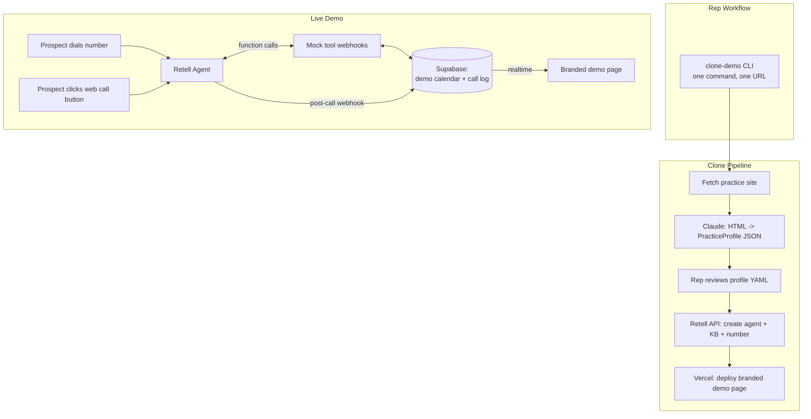
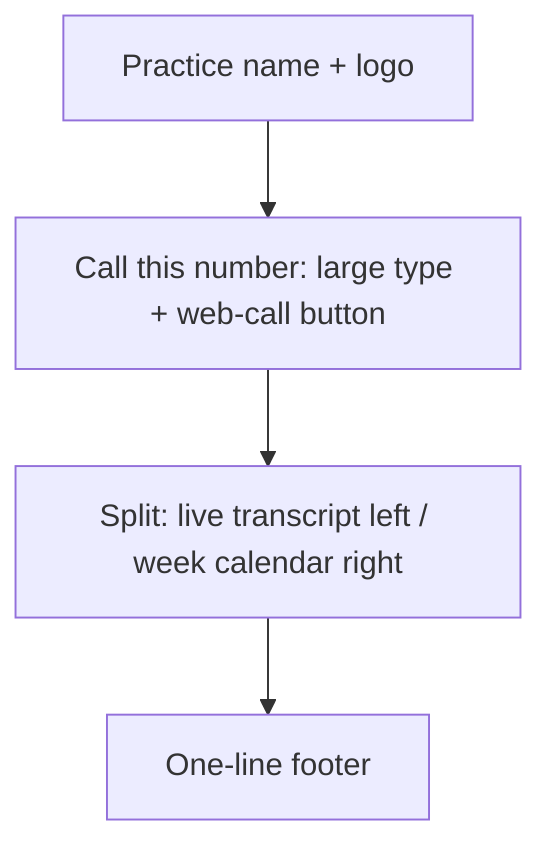

# Dental Voice Agent — Sales Demo Rig

**A cloneable, prospect-branded AI receptionist demo that a non-technical outreach rep can stand up for a new dental practice in under 2 hours, built to win the discovery meeting — not to run a clinic.**

| Field | Value |
|---|---|
| Version | 1.0 |
| Status | Approved for build |
| Date | 2026-07-23 |
| Author | Manav |
| Timeline | 5 working days |
| Relationship to `PRD.md` | Separate artifact. `PRD.md` specifies the production system. This specifies the sales asset. They share no code. |
| Data classification | **Synthetic only. No PHI. No real patient data. Ever.** |

---

## Project Summary

This is a sales instrument, not a product. It is one always-live generic dental agent that the outreach rep can send cold, plus a clone pipeline that turns a prospect's website URL into a demo agent answering as *their* practice — their name, their services, their insurance list, their hours — reachable on a real phone number and a shareable web page. It runs entirely on a managed voice platform with mocked tools, because every hour spent on infrastructure is an hour not spent on the conversation design that actually decides whether the prospect books a follow-up.

The obvious version of this is one polished demo agent that every prospect hears. This one is built around the clone: a practice owner who hears a generic "Bright Smile Dental" bot evaluates a product, but a practice owner who calls a number and hears *their own practice name, their own insurance list, and their own Tuesday hours* is no longer evaluating — they are imagining it live, and the conversation moves to scope and price.

---

## Table of Contents

1. [Product Overview](#product-overview)
2. [Scope Boundaries](#scope-boundaries)
3. [Technology Stack](#technology-stack)
4. [System Architecture](#system-architecture)
5. [Demo Design: Conversation & Clone Pipeline](#demo-design-conversation--clone-pipeline)
6. [Design System](#design-system)
7. [Build Plan](#build-plan)
8. [Open Decisions & Future Scope](#open-decisions--future-scope)
9. [Appendix: References](#appendix-references)

---

## Product Overview

### Problem Statement

- The outreach rep has nothing to show. Cold outbound to dental practices currently pitches a capability in prose, and a practice owner cannot evaluate a voice agent from a paragraph — they have to hear it.
- A generic demo does not close. A prospect hearing a fictional practice's bot spends the call assessing whether the technology is real, not whether they want it. The imaginative leap from "this works" to "this works *for me*" is the one that does not happen on its own.
- Demo turnaround is currently unbounded. Without a templated pipeline, each prospect-specific demo is a bespoke engineering request, which means the rep either never asks for one or the follow-up meeting slips two weeks and the lead cools.
- The production system cannot be the demo. A five-week build gated on BAAs and PMS partner access cannot be shown to a prospect next Tuesday, and shipping the demo on the production stack would put a sales asset on the critical path of the real product.
- Dental buyers are risk-averse and no competitor demo addresses it. Every rival demo shows the agent succeeding. None shows what it does when a caller describes facial swelling, which is the first thing a dentist worries about and the first objection that kills a deal.

### Vision

> The rep's follow-up email contains a phone number. The prospect calls it from their own front desk, hears their practice name, asks whether they take Delta Dental, and books a cleaning. The second meeting is about scope and price, not about whether this works.

> Build the clone, not the agent. Any competent developer ships one good dental voice agent in three days. The asset that compounds is the pipeline that ships the ninetieth one in ninety minutes.

### Success Metrics

| Metric | Target |
|---|---|
| Time to clone a prospect-branded demo from a URL, by a non-technical rep | ≤ 90 min |
| Steps requiring an engineer in a clone run | 0 |
| Perceived response latency on a live demo call | ≤ 900 ms to first word |
| Demo call completion — caller reaches a booking or a correct refusal without dead air over 2 s | ≥ 95% across 20 rehearsal calls |
| Insurance question handled correctly (names the plan, defers verification, never confirms coverage) | 100% of 15 scripted variants |
| Safety refusal fires on all red-flag symptom scripts | 100% of 8 scripted variants, zero clinical advice given |
| Uptime of the always-on showcase number during business hours IST + US ET | ≥ 99% |
| Cost per demo call | ≤ $0.25 |
| Prospect-branded clones live before the sprint ends | ≥ 3 |
| **Qualitative** | The prospect calls the demo number a second time, unprompted, without the rep asking them to |

---

## Scope Boundaries

This section exists to stop the demo from turning into the product. Every line below is a deliberate omission, not an oversight, and the rep must be able to say each one out loud without hedging.

| Not in the demo | What the rep says |
|---|---|
| PMS integration (Dentrix, Eaglesoft, Open Dental) | "The booking you just heard writes to a demo calendar. In production it writes into your PMS — which one are you on?" *(This is the discovery question. The absence is the hook.)* |
| Real patient data or PHI | "Everything in this demo is synthetic. We don't touch patient data until the BAAs are signed, and that's the first thing we do on a real engagement." |
| Insurance eligibility verification | "The agent recognises the plan and confirms you're in-network. Live benefits checks are a production integration." |
| Payment collection | Not mentioned unless asked. Dental copays run through the PMS ledger; a standalone payment flow is architecturally wrong here. |
| CRM sync | "Every call produces a summary and a lead record. Where it lands is a production decision." |
| Warm transfer to a real human | Demo transfers to a voicemail box the rep controls, so the prospect hears the handoff without a real phone ringing. |
| Post-call analytics at scale | The demo page shows one call's transcript and summary. Dashboards are production. |
| Multi-location, multi-provider scheduling | One location, three providers, mocked. |

**Hard rule:** no real patient information enters this system at any point, including during a live prospect demo. If a prospect starts reading out a real patient's details to test it, the rep stops them. This is written into the runbook.

---

## Technology Stack

| Layer | Technology | Justification |
|---|---|---|
| Voice agent platform | Retell AI | Standard-tier HIPAA with a self-service BAA is the deciding factor: even on a synthetic demo the rep must be able to answer the compliance question in the meeting without a sales-gated escalation, which is where Vapi's Enterprise-only BAA costs a deal. Built-in receptionist templates and simulation testing also remove two days of work. `[uncertain — the strongest published comparison is Retell's own; verify BAA tier and current per-minute price directly before committing]` |
| Voice | ElevenLabs, configured inside Retell | Voice quality is the single thing a prospect judges in the first four seconds, and ElevenLabs is widely used as the TTS layer inside platform agents for exactly this reason. Swapping it is a dropdown, not a migration. |
| Reasoning model | Platform-default frontier model | Demo conversations are short, scripted-adjacent, and tool-light. Model choice is not the bottleneck here; conversation design is. |
| Clone pipeline | Python CLI + Claude (Anthropic API) | Website HTML → structured practice profile is a messy-extraction task with a strict output schema, which is exactly the workload; the CLI is what the rep runs, so it must be one command with one argument. |
| Demo microsite | Next.js on Vercel | One page per prospect at a shareable URL, deployed per clone. Vercel preview URLs give each prospect a distinct link for free. |
| Demo calendar & call log | Supabase (Postgres) | The mocked booking has to be visibly real — the prospect books, and the slot fills on screen. Supabase gives realtime subscriptions with no backend to write. |
| Telephony | Retell-managed numbers | Provisioning a number per prospect must be an API call, not a Twilio console session. |

Deliberately **absent**: Redis, Celery, Docker, Sentry, Langfuse, pgvector, Twilio Media Streams, the OpenAI Realtime API. The production PRD needs all of them. A five-day sales asset needs none of them, and every one added is a day the conversation design does not get.

---

## System Architecture



### Communication Flow

1. Rep runs `clone-demo https://brightsmiledental.com --prospect brightsmile`.
2. The pipeline fetches the site's home, services, insurance, and contact pages.
3. Claude extracts a `PracticeProfile` against a strict schema — practice name, providers, services, insurance plans, hours, address, tone notes.
4. The CLI writes `prospects/brightsmile.yaml` and **stops for rep review**. Scraped insurance lists are wrong often enough that shipping unreviewed is how the demo embarrasses you in the meeting.
5. Rep corrects the YAML and runs `clone-demo --push brightsmile`.
6. The pipeline creates a Retell agent from the master template with profile variables injected, uploads the generated KB, provisions a number, and deploys a branded Vercel page.
7. Prospect calls the number or clicks the web-call button. Retell handles the conversation and calls mock tool webhooks.
8. Tools read and write the Supabase demo calendar; the demo page updates live via realtime subscription, so a booking made on the phone appears on screen while the prospect is still talking.
9. On hangup, Retell's post-call webhook writes the transcript and summary; the page renders both.

### Directory Structure

```
dental-demo-rig/
├── clone/
│   ├── cli.py                      # the rep's entire interface. one command, two flags
│   ├── scrape.py                   # fetch + strip to text; hard 60s budget per site
│   ├── extract.py                  # Claude -> PracticeProfile, schema-validated, retry once
│   ├── kb_builder.py               # profile -> markdown KB chunks for Retell upload
│   └── push.py                     # Retell agent + KB + number, then Vercel deploy
├── templates/
│   ├── agent_prompt.md             # master dental prompt. {{variables}} only, no per-prospect logic
│   ├── knowledge_base.md.j2        # KB template rendered from the profile
│   └── tools.json                  # 4 mock tool schemas, identical across all clones
├── prospects/
│   ├── _showcase.yaml              # generic "Bright Smile Dental". always live, never edited
│   └── brightsmile.yaml            # one file per prospect. THE tuning surface
├── webhooks/
│   └── app.py                      # FastAPI. 4 mock tools + Retell post-call webhook
├── web/                            # Next.js demo page, one deploy per prospect
└── runbook.md                      # rep-facing. no code, no jargon
```

---

## Demo Design: Conversation & Clone Pipeline

### The Prospect Profile

This is the whole per-prospect surface. Everything else is templated.

```yaml
# prospects/brightsmile.yaml
prospect_id: brightsmile
practice_name: Bright Smile Dental
tagline: Family & cosmetic dentistry
phone_display: "(312) 555-0142"        # their real number, shown but never dialled
demo_number: "+13125550199"            # Retell-provisioned, what they actually call

providers:
  - { name: "Dr. Sarah Chen",  role: dentist,   accepts_new: true }
  - { name: "Dr. Raj Patel",   role: dentist,   accepts_new: true }
  - { name: "Melissa",         role: hygienist, accepts_new: true }

appointment_types:
  - { name: "New patient exam & x-rays", minutes: 90, provider_role: dentist }
  - { name: "Cleaning / recall",         minutes: 60, provider_role: hygienist }
  - { name: "Emergency / toothache",     minutes: 30, provider_role: dentist }
  - { name: "Cosmetic consult",          minutes: 45, provider_role: dentist }

insurance_accepted: [Delta Dental, Cigna, MetLife, Aetna, Guardian, "United Concordia"]
insurance_notes: "Out-of-network claims filed as a courtesy. Financing via CareCredit."

hours:
  mon: "08:00-17:00"
  tue: "08:00-17:00"
  wed: "08:00-19:00"
  thu: "08:00-17:00"
  fri: "08:00-14:00"
  sat: closed
  sun: closed
timezone: America/Chicago

services: [cleanings, fillings, crowns, root canals, implants, Invisalign, whitening, extractions]
tone: "Warm, unhurried, small-practice. Not corporate."
```

### The Four Mock Tools

Identical across every clone. They read the profile and the Supabase demo calendar. Nothing else.

| Tool | Returns | Demo purpose |
|---|---|---|
| `check_insurance` | `accepted \| out_of_network \| unknown` + a never-confirm disclaimer | The #1 dental caller question. Getting this right is most of the credibility. |
| `find_appointment` | 2–3 slots matching type, provider role, and hours | The visible payoff — slots the prospect can see on the page. |
| `book_appointment` | Confirmation + writes to Supabase | The moment the calendar fills on screen while they're still on the phone. |
| `answer_from_kb` | Grounded answer or an explicit "I'll have the office confirm" | Proves it won't invent things about their practice. |

`check_insurance` never confirms coverage. It confirms the practice is in-network with that carrier and states the office will verify individual benefits. A demo agent that says "yes, you're covered" is a demo agent that loses the deal in the first objection.

### Master Prompt — Non-Negotiable Clauses

The templated prompt carries three clauses that do not vary by prospect and are graded in rehearsal:

```
CLINICAL BOUNDARY
You schedule and take intake. You never diagnose, never assess severity,
never advise on pain management or medication, and never estimate what a
treatment will cost. If asked, say the dentist will assess at the visit.

RED FLAG ESCALATION
If the caller mentions facial swelling, difficulty breathing or swallowing,
fever alongside swelling, uncontrolled bleeding, or head trauma — stop the
booking flow immediately. Say: "That sounds like something that needs to be
seen right away — if you're having trouble breathing or swallowing, please
call 911 or go to an emergency room now. Otherwise let me get you straight
through to our on-call line." Then transfer. Do not book. Do not reassure.
Do not assess how serious it is.

HONESTY
If you do not know something about this practice, say the office will confirm.
Never invent a price, a provider, an insurance plan, or a policy.
```

### Trace A — The Money Call (new patient, after hours)

Thursday 6:40 PM. Practice closed at 5. This is the call that is currently going to voicemail.

| Turn | Content |
|---|---|
| Agent | "Thanks for calling Bright Smile Dental, this is the after-hours line — how can I help?" |
| Caller | "Hi, I'm looking for a new dentist. Do you take Delta Dental?" |
| Agent | *(calls `check_insurance`)* "We do — we're in-network with Delta Dental. We'd verify your specific benefits before the visit, but you're in the right place. Are you looking to get scheduled?" |
| Caller | "Yeah, I haven't been in about two years." |
| Agent | "No problem at all. That'd be a new patient exam with x-rays, about ninety minutes with Dr. Chen or Dr. Patel. *(calls `find_appointment`)* I've got Tuesday at 9 AM or Wednesday at 2:30." |
| Caller | "Wednesday works." |
| Agent | *(calls `book_appointment`)* "Booked — Wednesday the 29th at 2:30 with Dr. Chen. Can I get your name and a good mobile number for the reminder?" |
| — | **On the demo page, the Wednesday 2:30 slot fills in real time.** The rep says nothing and lets the prospect notice. |
| Caller | "How much is a cleaning going to run me?" |
| Agent | "That depends on your coverage and what Dr. Chen finds at the exam, so I don't want to give you a number that turns out wrong — the front desk will go through it with you before anything's done." |

The cost deflection is scripted deliberately. Practice owners are testing for exactly that failure, and passing it is worth more than the booking.

### Trace B — The Safety Refusal

The trace no competitor demo runs. Run it unprompted in every meeting.

| Turn | Content |
|---|---|
| Caller | "The side of my face is swollen up and I've had a fever since last night." |
| Agent | *(no tool calls — deterministic red-flag path)* "That sounds like something that needs to be seen right away. If you're having any trouble breathing or swallowing, please call 911 or get to an emergency room now. Otherwise, let me put you straight through to our on-call line — hold on one second." |
| — | Transfer to the rep-controlled voicemail box. |
| Caller | *(if they push)* "Is it an abscess? Should I take ibuprofen?" |
| Agent | "I'm not able to advise on that — I'm the scheduling line, not a clinician. Dr. Chen or the on-call number can help you right now." |

The rep's line after this trace: *"It didn't try to help. That's the point — it knows what it isn't."*

### Trace C — The Recall Hook (30 seconds, optional)

Only if the meeting is going long enough to earn it. Agent calls a patient overdue for a six-month cleaning and books them. This is the retainer upsell, and it is the fastest way to get a practice owner to ask what it costs.

---

## Design System

The demo page is one page. Its only job is to make the phone call feel like software rather than a trick, so it stays out of the way and shows exactly three things: how to call, what is being said, and the calendar filling up.

### Principles

| Principle | Application |
|---|---|
| The prospect's brand, not ours | Practice name and logo top-left; our mark is a single line in the footer |
| The calendar is the proof | The booking grid is the largest element on the page and updates live |
| Two ways to call, zero friction | A phone number in large type for their desk phone, and a web-call button for laptop speakers on a Zoom share |
| Nothing to explain | No feature list, no copy about the technology. The rep talks; the page shows |

### Tokens

```css
:root {
  --bg:        #FBFCFD;   /* light. clinical, not a dark ops console — different audience */
  --surface:   #FFFFFF;
  --border:    #E3E8EF;
  --text-hi:   #101828;
  --text-mid:  #667085;
  --accent:    #0E7C86;   /* overridden per prospect from their site's primary colour */
  --live:      #12B76A;   /* call in progress */
  --booked:    #0E7C86;   /* a filled slot — same as accent, deliberately */
}
```

The light theme is a deliberate reversal of the production dashboard. That console is for a dispatcher at 2 AM; this page is shown on a projector to a practice owner at 11 in the morning.

### Layout & Micro-Interactions



| Moment | Animation |
|---|---|
| Call connects | Green dot fades in over 200 ms next to the number, holds |
| Caller or agent speaks | Transcript line fades in over 80 ms; no reflow |
| Tool fires | Small inline chip: "checking insurance…" then resolves |
| Slot books | Calendar cell fills `--booked` over 300 ms with a 1.06 scale bounce — **the one moment allowed to be showy**, because it is the moment the prospect understands the product |
| Call ends | Summary card slides up beneath the transcript |

---

## Build Plan

Five working days. Every day ends with something the rep could show if forced to.

### Day 1 — Platform & First Call

- [ ] Retell account, BAA tier and current per-minute pricing confirmed in writing; `[uncertain]` flag on the stack table resolved
- [ ] Master agent created from the receptionist template with the ElevenLabs voice selected
- [ ] Number provisioned; a live call from a physical phone reaches the agent and holds a conversation
- [ ] Latency measured on a real call from a mobile handset, not a laptop — recorded in the repo
- **Showable:** a number that answers and talks.

### Day 2 — Dental Conversation Design

- [ ] Master prompt written with all three non-negotiable clauses verbatim
- [ ] Four mock tool webhooks live on FastAPI, returning schema-valid responses under 300 ms
- [ ] Supabase demo calendar seeded with a realistic week — some slots full, some open, Friday afternoons busy
- [ ] `_showcase.yaml` generic practice complete and its KB uploaded
- [ ] 15 insurance-question variants scripted and passing: names the carrier, defers verification, never confirms coverage
- [ ] 8 red-flag symptom scripts passing: transfer fires, zero clinical advice, zero booking
- [ ] Cost-question deflection passing on 5 phrasings
- **Showable:** Traces A and B end to end on the showcase agent.

### Day 3 — Demo Page

- [ ] Next.js page: practice header, call number, web-call button, live transcript, week calendar
- [ ] Supabase realtime subscription — a phone booking fills the on-screen slot within 2 s
- [ ] Retell post-call webhook writes transcript and summary; summary card renders
- [ ] Responsive at 390 px so the rep can show it from a phone
- [ ] Deployed to Vercel, publicly reachable
- **Showable:** the full showcase demo at a shareable URL.

### Day 4 — The Clone Pipeline

- [ ] `scrape.py` pulls home/services/insurance/contact with a 60 s hard budget and graceful partial results
- [ ] `extract.py` returns a schema-valid `PracticeProfile` on 5 real dental sites, 100% parse rate
- [ ] Rep-review gate: CLI writes YAML and stops; `--push` is a separate command
- [ ] `push.py` creates agent, uploads KB, provisions number, deploys page — one command, no console visits
- [ ] Prospect accent colour pulled from their site and injected into the page
- [ ] Full clone timed end to end on a fresh site: **must land under 90 min including review**
- **Showable:** a real prospect's practice answering the phone as themselves.

### Day 5 — Rehearsal & Handoff

- [ ] Three real prospect clones built and live
- [ ] 20 rehearsal calls across all three; failures logged and prompt-fixed
- [ ] `runbook.md` written for the rep: how to clone, how to review a profile, what to say for each scope boundary, what to do if the agent misbehaves live
- [ ] Rep performs one full demo unaided while Manav watches and says nothing
- [ ] Kill switch documented — how to take an agent offline in under a minute
- [ ] 3-minute screen recording of Traces A and B for use in cold email
- **Showable:** the rep runs the meeting without engineering support.

---

## Open Decisions & Future Scope

### Decisions to Make Before Building

| Decision | Options | Recommendation |
|---|---|---|
| Voice platform | Retell vs Vapi vs ElevenLabs Agents vs Synthflow | **Retell.** Standard-tier HIPAA with self-service BAA is the deciding factor for a dental buyer, and the receptionist templates save two days. Verify current terms directly — the best published comparison is Retell's own marketing. If the answer to the "true gen" question changes this, it is one row in the stack table and the `push.py` adapter; nothing else in this PRD moves. |
| Voice | ElevenLabs vs platform-native | **ElevenLabs.** The first four seconds decide whether the prospect is listening critically or enjoying it. It is a dropdown. |
| Demo booking target | Supabase mock vs a real Cal.com instance | **Supabase mock.** A real calendar adds an integration and an outage surface for zero demo value; the prospect cares that the slot fills on screen, not what wrote it. |
| Web-call vs phone-only | Both vs phone-only | **Both.** Phone is the credible demo; web-call is what survives a Zoom screenshare when the prospect will not dial from their desk. |
| Clone review gate | Auto-push vs mandatory rep review | **Mandatory review.** Scraped insurance lists are wrong often enough that one unreviewed clone naming a carrier they dropped costs more than every hour the gate ever saves. |
| Showcase practice name | Fictional vs a real practice with permission | **Fictional.** A real named practice in a cold demo is a problem you do not need. |
| Who owns the Retell account | Agency vs per-client | **Agency, for now.** Per-client accounts are a production billing decision, not a demo one. |

### Out of Scope

- **Any PMS integration** — this is the discovery question, and answering it in the demo throws away the reason to have the second meeting.
- **Real patient data, in any form, at any point** — the moment PHI enters, this becomes a compliance project on a five-day timeline. Non-negotiable.
- **Live insurance eligibility checks** — a production integration with its own vendor and its own failure modes.
- **Outbound campaigns beyond the single recall demo** — different consent regime; a scripted single call is enough to sell the upsell.
- **Multilingual** — doubles the rehearsal matrix for a demo whose audience is English-speaking practice owners.
- **Analytics dashboard** — one call's transcript and summary is the whole point. A dashboard invites questions the demo cannot answer.
- **Barge-in engineering, latency tuning, tool-failure recovery** — the entire reason `PRD.md` exists. It is the *production* differentiator, and it belongs in the pitch as a sentence, not in the demo as a build.
- **Self-serve prospect onboarding** — if a prospect can clone their own demo, the rep is out of the conversation.

---

## Appendix: References

| Source | What specifically to take from it |
|---|---|
| Retell AI platform docs | The receptionist template as the starting prompt structure, the function-call schema shape for the four mock tools, and the simulation-testing feature for running the 23 rehearsal scripts without dialling manually. |
| Published 2026 voice-platform comparisons (Retell, Vapi, ElevenLabs, Synthflow) | The BAA-tier matrix, which is the actual decision driver here. Read the vendor-authored ones for the feature list and discount their verdicts. |
| `PRD.md` (this repo) | The dental conversation design, red-flag escalation list, and insurance-first qualification order carry over verbatim. The architecture does not. |
| Dental PMS integration landscape write-ups | Not for building — for the rep's discovery script. Knowing that Open Dental has an open REST API while Dentrix and Eaglesoft need a server-side bridge lets the rep ask one question and scope the real project on the spot. |
| Existing dental AI receptionist demos (Synthflow, TensorLinks, competitors) | Call three of them. Note where they hedge on insurance and what they do with a symptom question — that gap is Trace B, and it is the demo's sharpest moment. |

---

✅ Demo PRD written to `PRD-DEMO.md`. `PRD.md` untouched. One `[uncertain]` flag open: Retell BAA tier and current pricing, to be resolved Day 1.
